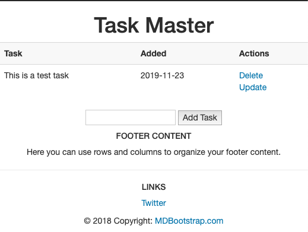

# Playing Around with Flask, Remote Development, and Deployment

This is a repository I'm using to train myself in a few things. It will evolve over time, and so I will aim to use tags to release versions, of sorts, for easy reference.

In the initial release, I've just created a small task keeping web app, having followed [this excellent tutorial](https://www.youtube.com/watch?v=Z1RJmh_OqeA). I embelished it a bit by playing around with Bootsrap:



### Prerequisites

* Docker
* Visual Studio Code
  * Docker Extension
  * Remote Development Extension

> Note that the Dockerfile in this repository is set to use `ubuntu:bionic` as the OS, which means that python3.6 is used, which is mirrored in the setup below.

### Initial Setup

Currently this app can be developed and tested in a docker container in VS Code by doing the following within a folder of your choice:

```sh
cd <wherever_you_on_your_local_machine>
git clone https://github.com/rorads/demo_flask_app.git
```

In VS Code, open the cloned repository in the editor, then open the command palate and choose `Remote-Containers: Open Repository in Container...`. This will build an image, and then launch and attach to a container based off of the specifications outlined in the [.devcontainer](.devcontainer/) folder.

#### Install Requirements (docker, so no need for virtualenv)

```sh
virtualenv -p python3.6 .env
source .ve/bin/activate
pip3 install -r requirements.txt
```

You may need to reload your container session by closing and reconnecting in order for VS Code to give you the option of running python files through the `.env` executable.

### Intial DB Setup

Within your `.env` python3 environment, enter the interactive python interpreter and do the following:

```py
>>> from app import db
>>> db.create_all()
>>> quit()
```

### Running the server

Running from the terminal is simple. Just enter the `.env` environment and type 

```sh
python3 app.py
```

Running using VS Code's interactive debugger is recommended, as it gives a great insight into the variables being passed around. It was quite fiddly to set up. It resides in this section (annotations added here) in the [launch.json](.vscode/launch.json) file:

```yaml
  "configurations": [
    {
      "name": "Python: Flask",
      "type": "python",
      "request": "launch",
      "module": "flask",
      "env": {
        "FLASK_APP": "app.py",
        "FLASK_ENV": "development",
        "FLASK_DEBUG": "0",
        "LC_ALL":"C.UTF-8", # This was suggested by VS Code after an inital try failed
        "LANG":"C.UTF-8"    # Ditto
      },
      # the "--host" argument is required here, even though it was already specified in app.py
      "args": ["run", "--host=0.0.0.0",  "--no-debugger", "--no-reload"],
      "jinja": true
    },
# ...
  ]
```

